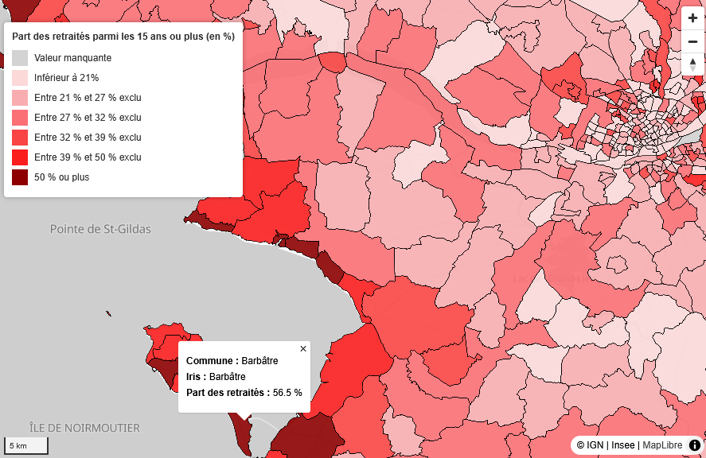

# Démonstration cartographie interactive tuilée

Exemple minimal de création et visualisation d'une carte interactive "fluide" de données fines à l'aide de [maplibre](https://maplibre.org/), [tippecanoe](https://github.com/felt/tippecanoe) et le format [pmtiles](https://docs.protomaps.com/pmtiles/). 

L'approche consiste à réunir contours géographiques et données un même fichier "tuilé" afin d'en proposer rapidement un rendu.
Le principe présenté est utilisé par [l'outil interactif de cartographie infracommunale de l'Insee](https://www.insee.fr/fr/outil-interactif/7737357/index.html).

L'exemple donné consiste à représenter une donnée issue du [recensement de la population](https://www.insee.fr/fr/metadonnees/definition/c1486) par [Iris](https://www.insee.fr/fr/metadonnees/definition/c1523) sur l'ensemble de la France métropolitaine (**+48 000** territoires/polygones), mais peut servir de base pour produire une carte équivalente sur tout autre donnée et territoires.

## Installation
Pré-requis :
- [tippecanoe](https://github.com/felt/tippecanoe?tab=readme-ov-file#installation) (Linux/Mac requis)
- R

Le projet peut s'exécuter notamment dans [un service RStudio du SSPcloud](https://datalab.sspcloud.fr/). Exécuter ensuite `0_install_tippecanoe.sh` pour installer ensuite tippecanoe.

## Utilisation

### Préparer le jeu de donnée tuilé (pmtiles)

#### Transformer un ficher de type shapefile ou geopackage en geojson

Le script `1_transformer_shapefile_en_geojson.R` permet de transformer un fichier shapefile ou geopackage en un fichier geojson.

#### Enrichir un geojson avec des indicateurs

Le script `2_enrichir_geojson_indicateur_rp_2022.R` prend en entrée un fichier geojson et un fichier csv qui contient les indicateurs du recensement de la population 2022.
En sortie, un fichier geojson avec les indicateurs RP 2022 est généré.

#### Transformer un fichier geojson en fichié tuilé (.pmtiles) avec l'outil tippecanoe

Le script `3_transformer_geojson_en_pmtiles_tippecanoe.R` permet à partir d'un geojson de créer un fichier tuilé pmtiles.
Pour pouvoir exécuter le script, il est nécessaire que l'outil tippecanoe soit installé. Le plus simple est d'utiliser un service LS3 ou SSPcloud.

### Visualiser le jeu de donnée en R

Le script `4_afficher_pmtiles_dans_R.R` permet d'afficher dans R un fichier pmtiles qui s'appelle fm.pmtiles.

### Visualiser le jeu de donnée sur une page web

Dans le dossier `affichage pmtiles html`, il y a le fichier index qui est un fichier html qui requête le fichier fm.pmtiles pour afficher la carte.
Le fichier fm.pmtiles est un fichié tuilé qui contient la géométrie des iris ou communes ainsi que quelques variables, comme la part des retraités parmi les 15 ans ou plus.